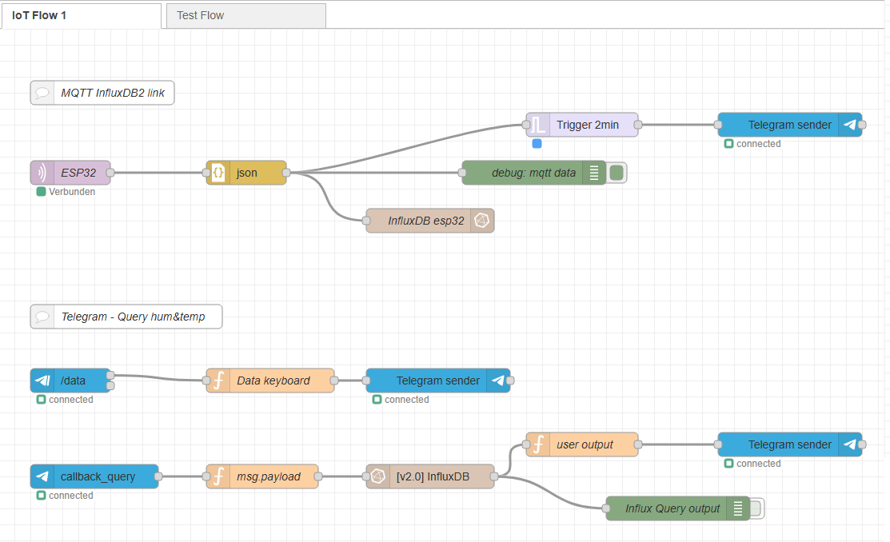

# IoT Project - ESP32 & Node-RED Backend

This project uses an **ESP32** to send sensor data via **MQTT**, which is processed and stored in **Node-RED**. The data is stored in **InfluxDB**, and a **Telegram bot** allows users to query the data.

## Project Components

- **ESP32 Scripts**: Sends sensor data via MQTT to Node-RED.
- **Node-RED Backend**: Processes received data, stores it in InfluxDB, and interacts with a Telegram bot.

## How to Set Up the Project

### 1. ESP32 Setup
- **Flash the ESP32** with the provided script to read sensor data and send it to the MQTT broker.

### 2. Node-RED Setup
- Import the flow file into Node-RED.
- Configure MQTT, InfluxDB, and the Telegram bot as described below.

### 3. Telegram Bot Setup
- Configure the Telegram bot in Node-RED to query the data.
- Set the bot token and chat IDs in the Node-RED Telegram node.

---

### Future Work
- Python-based backend in development.

# IoT Project Documentation

This project demonstrates the integration of IoT devices using Node-RED.

## IoT Flow Diagram

Below is the IoT flow in Node-RED which integrates sensors and MQTT communication.

## Test Flow Diagram

This is the Node-RED flow used for testing purposes.

